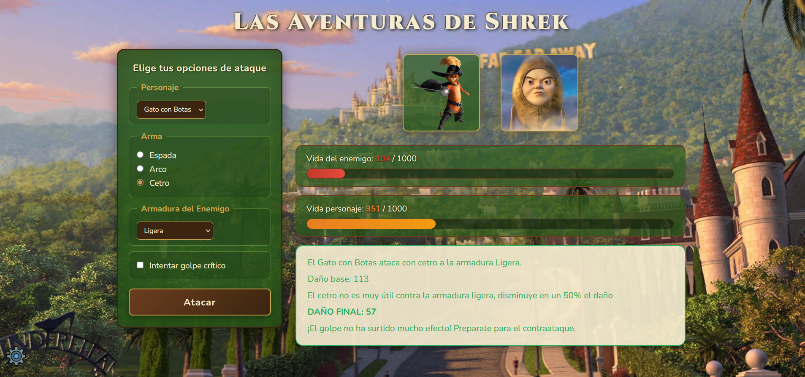
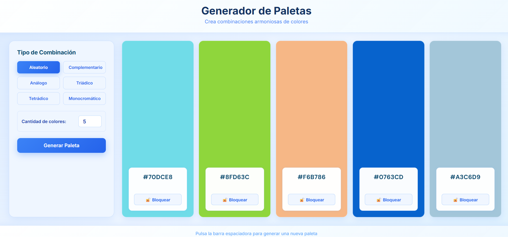
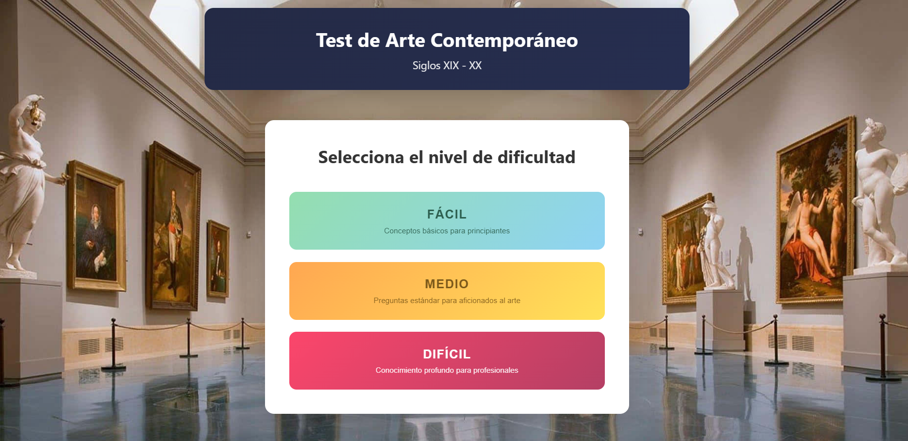
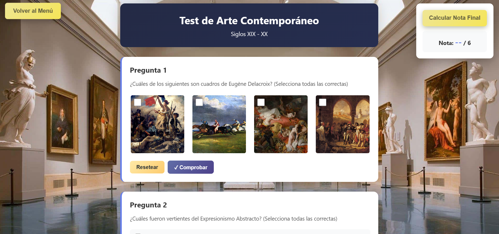
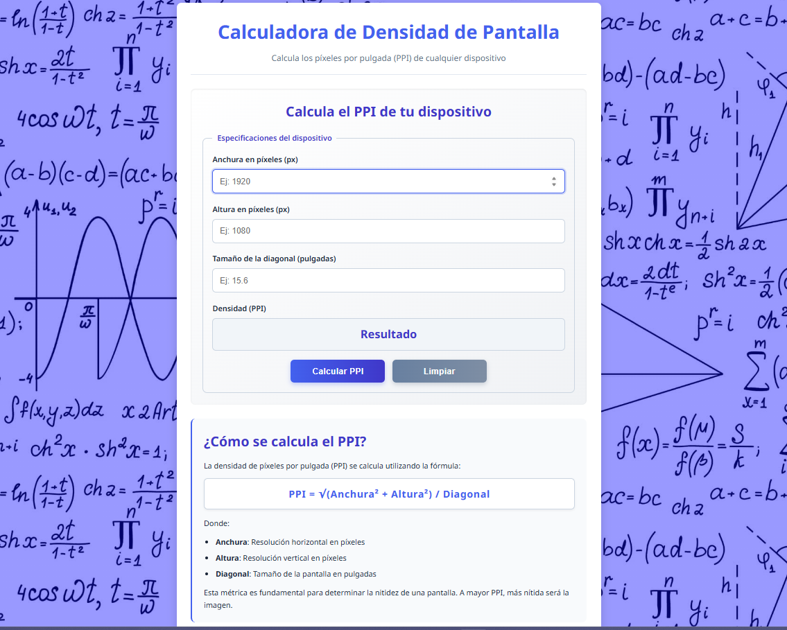

# Frontend-mini-projects

## Descripción

Varias prácticas básicas de clase con js, html y css:

- RPG simple inspirado en Shrek
- generador de paletas de colores
- test multinivel de historia del arte
- calculadora de densidad de pantalla

## Funcionalidades RPG Shrek
- Seleccionar personaje jugador, enemigo y arma
- Posibilidad de seleccionar ataque crítico
- Atacar

## Funcionalidades Generador de Paletas
- Elegir número y tipo de combinación de colores
- Generar paleta
- Bloquear colores

## Funcionalidades Test de arte

- Seleccionar nivel
- Responder pregunta
- Ver resultados
- 
## Funcionalidades Calculadora densidad de píxeles
- Introducir datos y ver resultados

## Tecnologías

- **Frontend:** HTML, CSS, JavaScript 

## Estado de los Proyectos
- finalizados

## Autor

Desarrollado por Alba Llano

Email: alballanomanrique28@gmail.com

LinkedIn: [linkedin.com/in/alballanoma](https://linkedin.com/in/alballanoma)

GitHub: [github.com/alblm28](https://github.com/alblm28)

## Licencia

MIT
